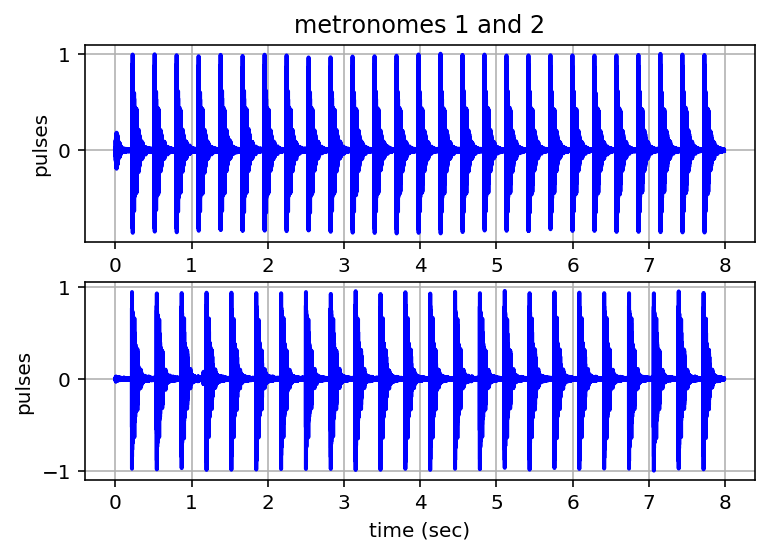
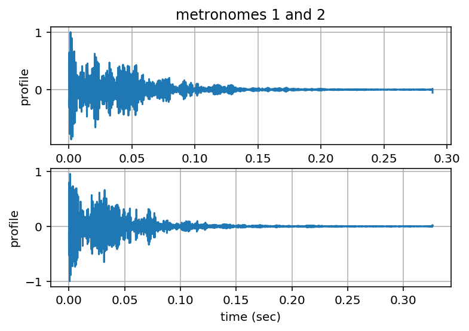
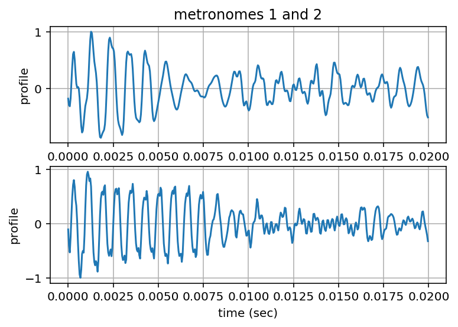
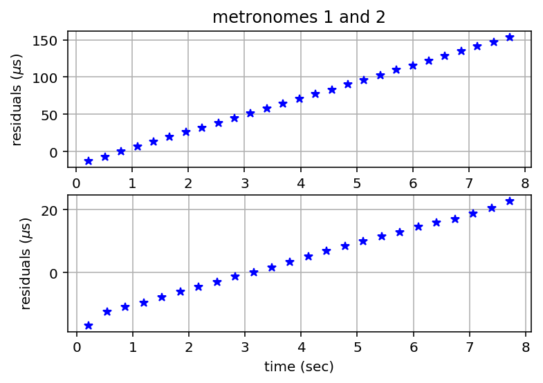
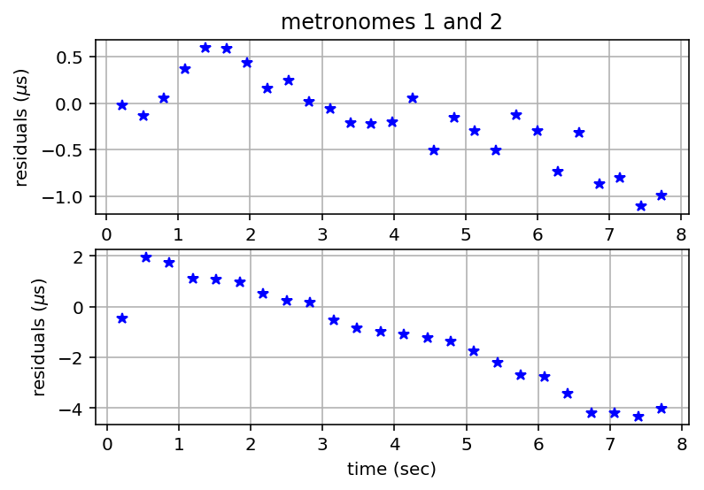
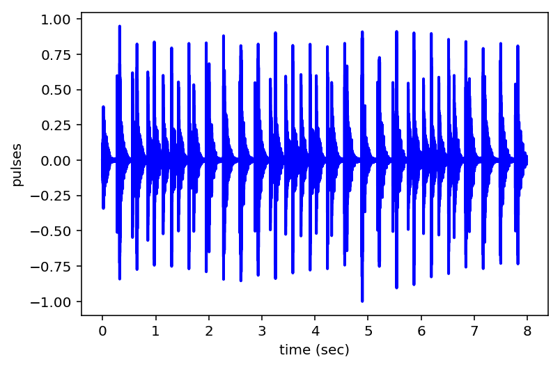
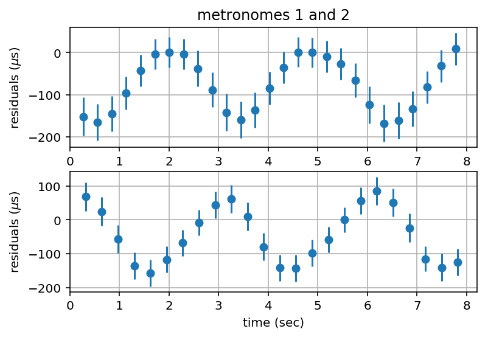
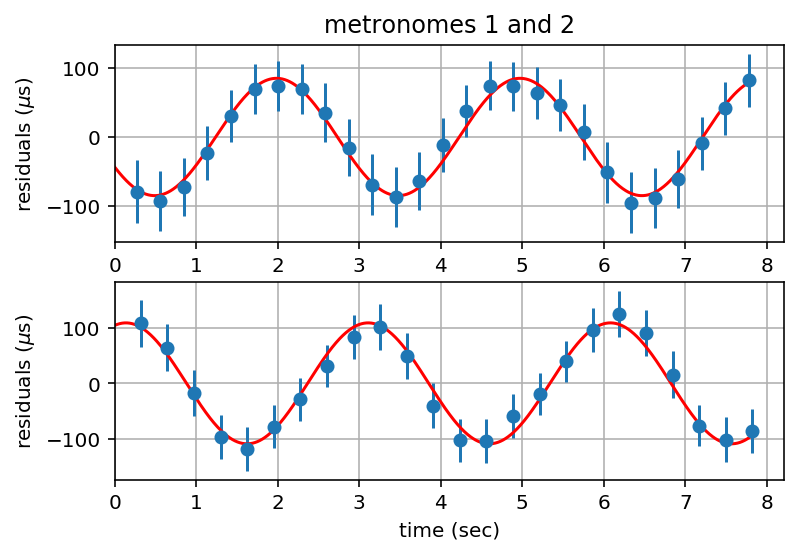

.. module:: enterprise

.. note:: This tutorial was generated from a Jupyter notebook that can be
          downloaded `here <_static/notebooks/PTAdemo.ipynb>`_.

.. _PTAdemo:

PTA Demo 1: Analyze reference metronome data files
==================================================

The folowing demonstration notebook goes through the various commands
needed to get profiles from single metronome observations and then to
analyze the signal from double metronomes to get the correlations that
reveal the motion of the recording microphone. All of the functionality
is available in a GUI format by calling the commands
``PTAdemo_single_metronome`` and ``PTAdemo_double_metronome``.

Record single metronome pulses
------------------------------

.. code:: python

    # filenames and beats per minute
    path = tpta.__path__ + '/demo_data/'
    metfile1 = path + 'm208a'
    metfile2 = path + 'm184b'
    metfiles = path + 'm208a184b'
    bpm1 = 208
    bpm2 = 184

Play recorded pulses
--------------------

.. code:: python

    # sample rate
    Fs = 44100
    
    # play recorded sound
    ts1 = tpta.playpulses(metfile1 + ".txt")
                                                            
    # plot time series
    plt.figure()
    plt.subplot(2,1,1)
    plt.plot(ts1[:,0], ts1[:,1], lw=2, color='b')
    plt.ylabel('pulses')
    plt.title('metronomes 1 and 2')
    plt.grid('on')
    
    # play recorded sound
    ts2 = tpta.playpulses(metfile2 + ".txt")
    
    # plot time series
    plt.subplot(2,1,2)
    plt.plot(ts2[:,0], ts2[:,1], lw=2, color='b')
    plt.xlabel('time (sec)')
    plt.ylabel('pulses')
    plt.grid('on')
    plt.draw()
    
    # print to file
    plt.savefig(metfiles + "_pulses.pdf", bbox_inches='tight')

Calculate and Plot Pulse Profiles
---------------------------------

.. code:: python

    # metronome 1
    print('calculating pulse period and profile of metronome 1...')
    [profile1, T1] = tpta.calpulseprofile(ts1, bpm1)
    print('T1 = ', T1, 'sec')
    
    # plot pulse profile
    plt.figure()
    plt.subplot(2,1,1)
    plt.plot(profile1[:,0], profile1[:,1])
    plt.ylabel('profile')
    plt.title('metronomes 1 and 2')
    plt.grid('on')
    
    # write pulse profile to file
    outfile1 = metfile1 + "_profile_nb.txt"
    np.savetxt(outfile1, profile1)
    
    # metronome 2
    print('calculating pulse period and profile of metronome 2...')
    [profile2, T2] = tpta.calpulseprofile(ts2, bpm2)
    print('T2 = ', T2, 'sec')
    
    # plot pulse profile
    plt.subplot(2,1,2)
    plt.plot(profile2[:,0], profile2[:,1])
    plt.xlabel('time (sec)')
    plt.ylabel('profile')
    plt.grid('on')
    plt.draw()
    
    # write pulse profile to file
    outfile2 = metfile2 + "_profile_nb.txt"
    np.savetxt(outfile2, profile2)
    
    # print to file
    plt.savefig(metfiles + "_profilesb_n.pdf", bbox_inches='tight')

.. parsed-literal::

    calculating pulse period and profile of metronome 1...
    T1 =  0.288561538462 sec
    calculating pulse period and profile of metronome 2...
    T2 =  0.326096956522 sec

Zoom-in on Profiles
-------------------

.. code:: python

    Nzoom = np.int(np.round(0.01*Fs))
    
    plt.figure()
    plt.subplot(2,1,1)
    plt.plot(profile1[:Nzoom,0], profile1[:Nzoom,1])
    plt.ylabel('profile')
    plt.title('metronomes 1 and 2')
    plt.grid('on')
    
    plt.subplot(2,1,2)
    plt.plot(profile2[:Nzoom,0], profile2[:Nzoom,1])
    plt.xlabel('time (sec)')
    plt.ylabel('profile')
    plt.grid('on')
    plt.draw()
    
    # print to file
    plt.savefig(metfiles + "_profiles_zoom.pdf", bbox_inches='tight')

Calculate Residuals
-------------------

.. code:: python

    # calculate residuals for metronome 1
    template1 = tpta.caltemplate(profile1, ts1)
    [measuredTOAs1, uncertainties1, n01] = tpta.calmeasuredTOAs(ts1, template1, T1)
    Np1 = len(measuredTOAs1)
    expectedTOAs1 = tpta.calexpectedTOAs(measuredTOAs1[n01-1], n01, Np1, T1)
    [residuals1, errorbars1] = tpta.calresiduals(measuredTOAs1, expectedTOAs1, uncertainties1)
    
    # calculate residuals for metronome 2
    template2 = tpta.caltemplate(profile2, ts2)
    [measuredTOAs2, uncertainties2, n02] = tpta.calmeasuredTOAs(ts2, template2, T2)
    Np2 = len(measuredTOAs2)
    expectedTOAs2 = tpta.calexpectedTOAs(measuredTOAs2[n02-1], n02, Np2, T2)
    [residuals2, errorbars2] = tpta.calresiduals(measuredTOAs2, expectedTOAs2, uncertainties2)

Plot Residuals
--------------

.. code:: python

    plt.figure()
    plt.subplot(2,1,1)
    plt.plot(residuals1[:,0], 1.e6*residuals1[:,1], 'b*');
    plt.ylabel('residuals ($\mu$s)')
    plt.title('metronomes 1 and 2')
    plt.grid('on')
    
    plt.subplot(2,1,2)
    plt.plot(residuals2[:,0], 1.e6*residuals2[:,1], 'b*');
    plt.xlabel('time (sec)')
    plt.ylabel('residuals ($\mu$s)')
    plt.grid('on')
    plt.draw()
    
    # print to file
    plt.savefig(metfiles + "_residuals.pdf", bbox_inches='tight')

Calculate and Plot Detrended Residuals
--------------------------------------

.. code:: python

    [dtresiduals1, b, m] = tpta.detrend(residuals1, errorbars1);
    N1 = len(residuals1[:,0])
    T1new = T1 + m*(residuals1[-1,0]-residuals1[0,0])/(N1-1)
    print("improved pulse period estimate of metronome 1 =", T1new, "sec")
    
    [dtresiduals2, b, m] = tpta.detrend(residuals2, errorbars2);
    N2 = len(residuals2[:,0])
    T2new = T2 + m*(residuals2[-1,0]-residuals2[0,0])/(N2-1)
    print("improved pulse period estimate of metronome 2 =", T2new, "sec")
    
    # plot residuals
    plt.figure()
    plt.subplot(2,1,1)
    plt.plot(dtresiduals1[:,0], 1.e6*dtresiduals1[:,1], 'b*');
    plt.ylabel('residuals ($\mu$s)')
    plt.title('metronomes 1 and 2')
    plt.grid('on')
    
    plt.subplot(2,1,2)
    plt.plot(dtresiduals2[:,0], 1.e6*dtresiduals2[:,1], 'b*');
    plt.xlabel('time (sec)')
    plt.ylabel('residuals ($\mu$s)')
    plt.grid('on')
    plt.draw()
    
    # print to file
    plt.savefig(metfiles + "detrended_residuals.pdf", bbox_inches='tight')

.. parsed-literal::

    improved pulse period estimate of metronome 1 = 0.288567978601 sec
    improved pulse period estimate of metronome 2 = 0.32609882891 sec

PTA Demo 2 - Double-Metronome Correlations
==========================================

Record Double-Metronome Data
----------------------------

.. code:: python

    # filenames (time-series and pulse profiles)
    tsfile = 'm208a184b135'
    profilefile1 = 'm208a_profile'
    profilefile2 = 'm184b_profile'
    T1 = T1new
    T2 = T2new

.. code:: python

    #brecord pulses from both metronomes
    tpta.recordpulses(tsfile + ".txt")

Play Recorded Pulses
--------------------

.. code:: python

    # play recorded sound
    
    ts = tpta.playpulses(path + tsfile + ".txt")
                                                            
    # plot time series
    plt.figure()
    plt.plot(ts[:,0], ts[:,1], lw=2, color='b')
    plt.xlabel('time (sec)');
    plt.ylabel('pulses');
    plt.grid
    plt.draw()
    
    # print to file
    plt.savefig(tsfile + "_pulses.pdf", bbox_inches='tight')

Calculate Residuals
-------------------

.. code:: python

    # load pulse profiles
    profile1 = np.loadtxt(profilefile1 + ".txt")
    profile2 = np.loadtxt(profilefile2 + ".txt")
    
    # calculate residuals for metronome 1
    template1 = tpta.caltemplate(profile1, ts)
    [measuredTOAs1, uncertainties1, n01] = tpta.calmeasuredTOAs(ts, template1, T1)
    Np1 = len(measuredTOAs1)
    expectedTOAs1 = tpta.calexpectedTOAs(measuredTOAs1[n01-1], n01, Np1, T1)
    [residuals1, errorbars1] = tpta.calresiduals(measuredTOAs1, expectedTOAs1, uncertainties1)
    
    # calculate residuals for metronome 2
    template2 = tpta.caltemplate(profile2, ts)
    [measuredTOAs2, uncertainties2, n02] = tpta.calmeasuredTOAs(ts, template2, T2)
    Np2 = len(measuredTOAs2)
    expectedTOAs2 = tpta.calexpectedTOAs(measuredTOAs2[n02-1], n02, Np2, T2)
    [residuals2, errorbars2] = tpta.calresiduals(measuredTOAs2, expectedTOAs2, uncertainties2)

Plot Residuals
--------------

.. code:: python

    tlim = 1.05*max(residuals1[-1,0],residuals2[-1,0])
    
    plt.figure()
    plt.subplot(2,1,1)
    plt.errorbar(residuals1[:,0], 1.e6*residuals1[:,1], 1.e6*errorbars1[:,1], fmt='o')
    plt.xlim(0, tlim)
    plt.ylabel('residuals ($\mu$s)')
    plt.title('metronomes 1 and 2')
    plt.grid('on')
    
    plt.subplot(2,1,2)
    plt.errorbar(residuals2[:,0], 1.e6*residuals2[:,1], 1.e6*errorbars2[:,1], fmt='o')
    plt.xlim(0, tlim)
    plt.xlabel('time (sec)')
    plt.ylabel('residuals ($\mu$s)')
    plt.grid('on')
    plt.draw()

Fit Sinusoid with Constant Offset to Residuals and Plot
-------------------------------------------------------

.. code:: python

    # default parameter choices
    p1 = 2e-4
    p2 = 0.4
    p3 = 0
    p4 = 0
    
    #p1, p2, p3, p4  = input('input guess for amplitude, freq (Hz), phase (rad), offset (sec) for metronome 1: ')
    pars1 = np.zeros(4)
    pars1[0] = p1
    pars1[1] = p2
    pars1[2] = p3
    pars1[3] = p4
    
    pfit1, pcov1, infodict, message, ier = opt.leastsq(tpta.errsinusoid, pars1, args=(residuals1[:,0], residuals1[:,1], errorbars1[:,1]), full_output=1)
    
    # default parameter choices
    p1 = 2e-4
    p2 = 0.4
    p3 = 0
    p4 = 0
    
    #p1, p2, p3, p4  = input('input guess for amplitude, freq (Hz), phase (rad), offset (sec) for metronome 2: ')
    pars2 = np.zeros(4)
    pars2[0] = p1
    pars2[1] = p2
    pars2[2] = p3
    pars2[3] = p4
    
    pfit2, pcov2, infodict, message, ier = opt.leastsq(tpta.errsinusoid, pars2, args=(residuals2[:,0], residuals2[:,1], errorbars2[:,1]), full_output=1)
    
    # best fit sinusoids
    tfit = np.linspace(0, max(residuals1[-1,0], residuals2[-1,0]), 1024)
    yfit1 = pfit1[0]*np.sin(2*np.pi*pfit1[1]*tfit + pfit1[2])
    yfit2 = pfit2[0]*np.sin(2*np.pi*pfit2[1]*tfit + pfit2[2])
    
    # constant offsets
    N1 = len(residuals1[:,0])
    N2 = len(residuals2[:,0])
    offset1 = pfit1[3]*np.ones(N1)
    offset2 = pfit2[3]*np.ones(N2)
    
    # plot residuals with constants removed and with best fit sinusoids
    plt.figure()
    plt.subplot(2,1,1)
    plt.errorbar(residuals1[:,0], 1.e6*(residuals1[:,1]-offset1), 1.e6*errorbars1[:,1], fmt='o')
    plt.plot(tfit, 1.e6*yfit1, 'r-')
    plt.xlim(0, tlim)
    plt.ylabel('residuals ($\mu$s)')
    plt.title('metronomes 1 and 2')
    plt.grid('on')
    
    plt.subplot(2,1,2)
    plt.errorbar(residuals2[:,0], 1.e6*(residuals2[:,1]-offset2), 1.e6*errorbars2[:,1], fmt='o')
    plt.plot(tfit, 1.e6*yfit2, 'r-')
    plt.xlim(0, tlim)
    plt.xlabel('time (sec)')
    plt.ylabel('residuals ($\mu$s)')
    plt.grid('on')
    plt.draw()
    
    # print to file
    plt.savefig(tsfile + "_residuals.pdf", bbox_inches='tight')

Calculate Correlation Coefficient
---------------------------------

.. code:: python

    rhox, rhoy, rhoxy = tpta.calcorrcoeff(yfit1, yfit2)
    print('correlation coeff = ', rhoxy)

.. parsed-literal::

    correlation coeff =  -0.724534807671

